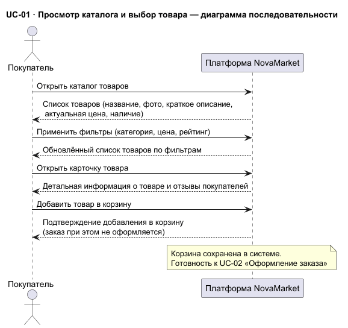
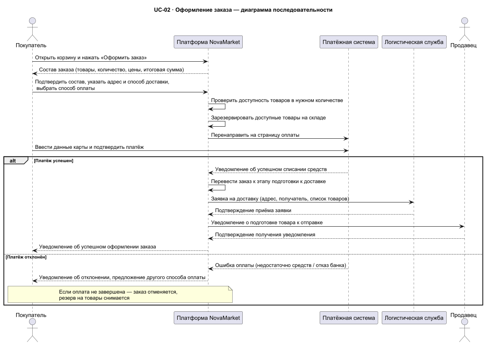
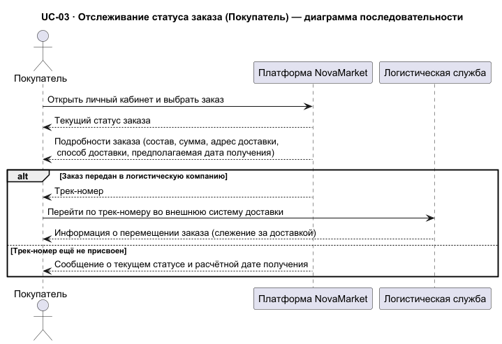
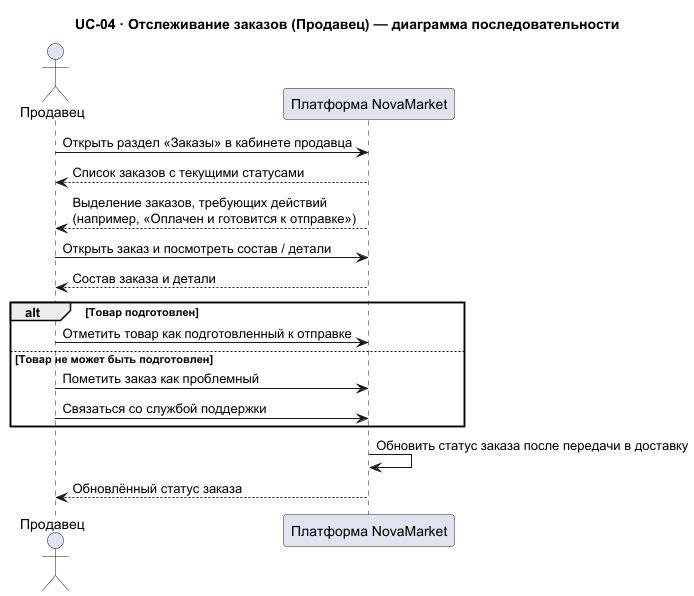
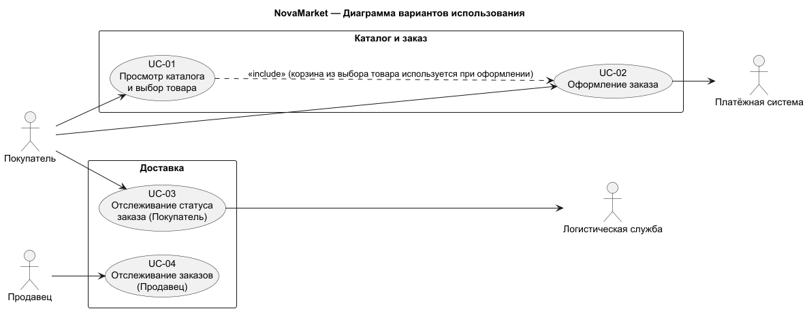

# NovaMarket — Варианты использования (Use Cases)

**Файлы данного каталога созданы с помощью ИИ на основе тестовых сценариев, приведённых в задании. Цель создания данного каталога - первичное исследование домена и выявление основных акторов и use case-ов.**

В данном разделе представлена модель вариантов использования (use cases) платформы NovaMarket: список акторов, описания сценариев по единому шаблону, а также UML-диаграммы — диаграмма вариантов использования и диаграммы последовательности.

Все документы сценариев оформлены по единому шаблону — см. [_use-case-template.md](_use-case-template.md).

## Задачи раздела

- Задокументировать ключевые функциональные сценарии платформы: просмотр каталога, оформление заказа и отслеживание статусов.
- Единообразно описать каждый сценарий (цель, акторы, предусловия, триггер, основной сценарий, расширения, постусловия, бизнес-правила).
- Дополнить описания UML-диаграммами для наглядности взаимодействия акторов с системой.

## Акторы

| Актор | Тип | Роль в системе |
|-------|-----|----------------|
| **Покупатель** | Основной | Инициатор основных сценариев: выбор товара (UC-01), оформление заказа (UC-02), отслеживание статуса заказа (UC-03) |
| **Продавец** | Основной (UC-04) / второстепенный (UC-02) | Получает уведомление о подготовке товара при заказе (UC-02); отслеживает и обрабатывает свои заказы (UC-04) |
| **Платёжная система** (банк / ПС) | Второстепенный | Обрабатывает оплату при оформлении заказа (UC-02) |
| **Логистическая служба** | Второстепенный | Принимает заявку на доставку (UC-02); предоставляет трек-номер и данные о перемещении заказа (UC-03) |

## Варианты использования

| ID | Название | Документ | Диаграмма последовательности |
|----|----------|----------|------------------------------|
| UC-01 | Просмотр каталога и выбор товара | [1-product-selection.md](1-product-selection.md) |  |
| UC-02 | Оформление заказа | [2-order-placement.md](2-order-placement.md) |  |
| UC-03 | Отслеживание статуса заказа (Покупатель) | [4-order-tracking-buyer.md](4-order-tracking-buyer.md) |  |
| UC-04 | Отслеживание заказов (Продавец) | [5-order-status-seller.md](5-order-status-seller.md) |  |

## Диаграмма вариантов использования (диаграмма Use Case-ов)

## Связанные документы

- [Шаблон описания варианта использования](_use-case-template.md)
- Исходные файлы диаграмм PlantUML: `*.puml` (в этой же папке)