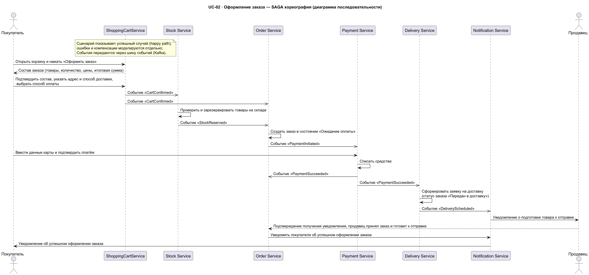
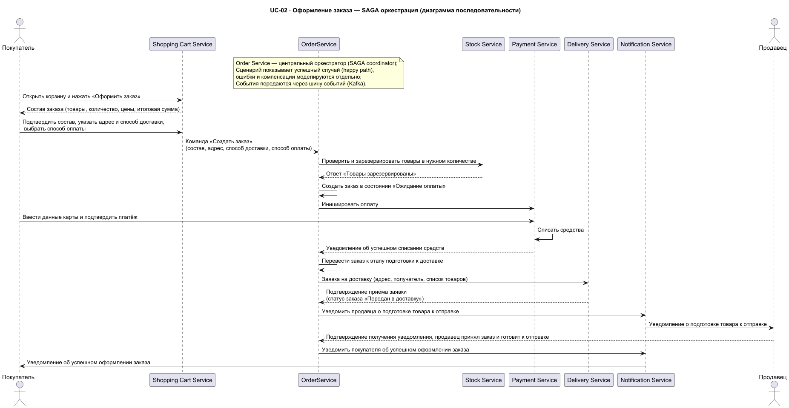

### **Название задачи:** Предложения по выбору паттерна SAGA (хореография или оркестрация)
### **Автор:** Иван Бабиков
### **Дата:** 14.09.2026

**Связанный документ:** [ADR-01 — Предложения по архитектуре микросервисов системы NovaMarket](ADR-01-microservices.md)

---

### Контекст

В [ADR-01](ADR-01-microservices.md) предложено строить NovaMarket сразу на микросервисной архитектуре. Оформление заказа (UC-02) затрагивает несколько сервисов: Shopping Cart Service, Stock Service, Order Service, Payment Service, Delivery Service и Notification Service. Для согласованного выполнения такого распределённого бизнес-процесса применяется паттерн **SAGA**. Данный документ сравнивает две реализации SAGA — **хореографию** и **оркестрацию** — и фиксирует выбор паттерна.

#### Диаграммы сравниваемых вариантов

**SAGA-хореография** — сервисы обмениваются событиями через шину событий (Kafka), без центрального координатора:

**SAGA-оркестрация** — Order Service выступает центральным координатором и явно вызывает остальные сервисы:

---

### 1. Comparison by standard criteria

| Критерий | Хореография (Kafka, событийно-ориентированная) | Оркестрация (Order Service = координатор) |
|---|---|---|
| **Скорость разработки** | Вначале быстрее на уровне отдельного сервиса, но интеграционные тесты и сквозная отладка дольше (нет центрального места, где «весь флоу») | Быстрее для цельного сценария у 1–2 команд: один оркестратор, детерминированный порядок, проще mock-тесты; каждый новый шаг — изменение только в оркестраторе |
| **Производительность / задержка** | Асинхронно развязано: покупатель получает ответ рано, остальное идёт фоном (хороший UX по U3); результат асинхронный (eventual consistency) | Синхронные await на каждом шаге — потенциально выше задержка «запрос→ответ», но проще гарантировать p99,99 за счёт явной последовательности |
| **Надёжность** | Нет единой точки отказа. Но компенсация рассредоточена: каждый сервис публикует свои компенсирующие события — много мест отказа, нужна идемпотентность и exactly-once | Центральные компенсации прямо в оркестраторе — надёжнее и проще контролируются; риск — Order Service как single point of failure (смягчается HA) |
| **Удобство и стоимость сопровождения** | Поток «размазан», труднее читается/отлаживается без distributed tracing; нужен событийный реестр (saga-events-registry); риск «распределённого монолита» | Весь сценарий легко читать и поддерживать; минус — высокая связность, изменения флоу затрагивают оркестратор (риск «божественного сервиса») |
| **Масштабируемость** | Лучше: сервисы параллелятся и масштабируются независимо (нужно для требования U2 «40 000+ заказов») | Горизонтальное масштабирование есть, но оркестратор — потенциальное узкое место каждой саги |
| **Слабосвязность / гибкость** | Отлично: новый подписчик (аналитика, антифрод, рекомендации) подключается без правок издателей — выполняет требование F10 | Низкая: добавление/изменение участников требует правки оркестратора |
| **Наблюдаемость / тестируемость** | Сложнее: нужен distributed tracing и инструменты очередей; сквозные тесты дороже | Лучше: состояние саги централизованно, легко повтороно вызывать шаги в случае ошибок, проще E2E-тесты |
| **Простота понимания** | Требует навыка «думать событиями»; общий флоу невидим | Интуитивно понятна — виден явный ход сценария |

### Итоговая сравнительная таблица с баллами и весами

Веса подобраны под приоритеты из ADR-01 — быстрый рост (U2), простое подключение новых сервисов (F10), требования к отклику (U3). Баллы — по 10-балльной шкале.

| № | Критерий | Вес | Хореография (балл) | Хореография (взвеш.) | Оркестрация (балл) | Оркестрация (взвеш.) |
|---|---|---|---|---|---|---|
| 1 | Масштабируемость (U2: до 40 000+ заказов) | 20 % | 9 | **1,80** | 6 | 1,20 |
| 2 | Слабосвязность / простота подключения новых сервисов (F10) | 20 % | 10 | **2,00** | 5 | 1,00 |
| 3 | Производительность / UX-задержка (U3) | 15 % | 8 | **1,20** | 7 | 1,05 |
| 4 | Надёжность / устойчивость к отказам | 15 % | 7 | 1,05 | 9 | **1,35** |
| 5 | Удобство и стоимость сопровождения | 15 % | 7 | 1,05 | 8 | **1,20** |
| 6 | Скорость разработки | 10 % | 6 | 0,60 | 8 | **0,80** |
| 7 | Наблюдаемость / тестируемость | 5 % | 5 | 0,25 | 9 | **0,45** |
| | **Итого** | **100 %** | | **7,95** | | **7,05** |

**Интерпретация:** хореография выигрывает за счёт критериев с наибольшим весом — масштабируемости и слабосвязности/F10, которые критичны для долгосрочного роста. Оркестрация опережает лишь в сопровождении, надёжности, скорости разработки и наблюдаемости — важных на старте, но не стратегически определяющих масштабирование.

---

### **Решение**

В качестве основного решения выбирается **SAGA-хореография** на шине событий (Kafka) — итоговый взвешенный балл 7,95 против 7,05 у оркестрации.

Преимущества хореографии для долгосрочного роста и масштабирования:

1. **Слабая связность и масштабируемость** — сервисы развиваются и масштабируются независимо, без узкого места центрального оркестратора; отвечает требованию U2 «40 000+ заказов в день».
2. **Простое подключение новых сервисов по подписке на события (F10)** — аналитика, антифрод, рекомендации, программа лояльности добавляются без изменения издателей событий; при оркестрации каждый шаг требовал бы правок центрального Order Service.
3. **Асинхронный отклик** — покупатель получает подтверждение раньше, что улучшает UX и соответствие U3.
4. **Отсутствие единой точки отказа и «божественного сервиса»** — при росте числа команд хореография лучше ложится на принцип «много команд = много доменов» (принцип Конвея).

События саги, используемые в хореографии, описаны в [saga-events-registry.md](saga-events-registry.md).

---

### **Альтернативы**

**SAGA-оркестрация** — центральный координатор (Order Service) явно вызывает сервисы и управляет компенсациями. Альтернатива предпочтительна, если приоритетом являются скорость первого релиза, простота отладки и централизованное управление компенсациями для небольшой команды на старте.

---

**Недостатки, ограничения, риски**

- Хореография сложнее в отладке и наблюдении: без distributed tracing общий поток труднее проследить; требуется событийный реестр и дисциплина версионирования событий.
- Надёжность компенсации рассредоточена между сервисами — нужны идемпотентность и гарантии доставки (at-least-once + обработка дублей).
- При избыточном росте числа событий возможен анти-паттерн «распределённый монолит» — необходима регулярная ревизия границ событий.
- Асинхронная природа даёт асинхронную согласованность данных (eventual consistency) — это ограничение нужно закладывать в продуктовые сценарии.
- Моделирование ошибок и компенсаций выполняется отдельно (за рамками happy-path диаграмм) — требуется отдельная проработка сценариев отказов.

