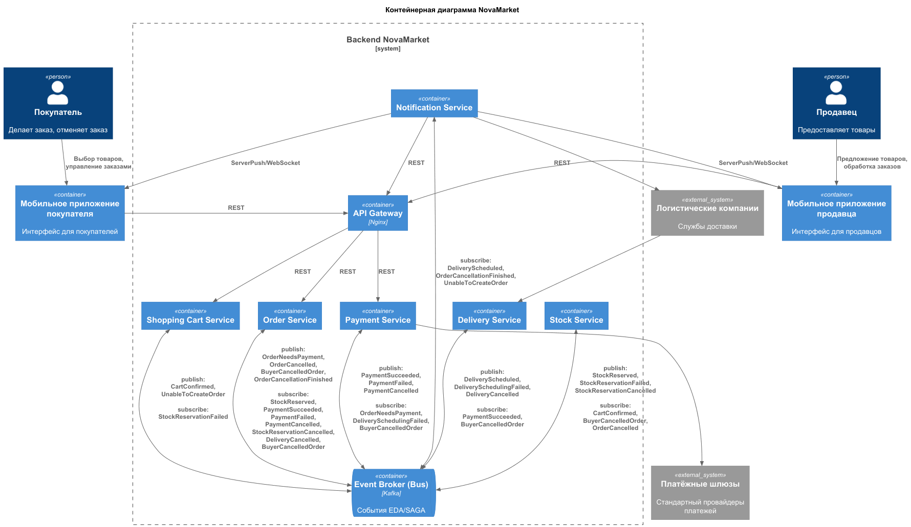

*Данный файл сгенерирован с помощью ИИ для описания артефактов проделанной работы*

### Название задачи: Обзор архитектуры NovaMarket на уровне контейнеров (C4 — Container)

**Автор:** Иван Бабиков
**Дата:** 16.09.2026

**Связанные документы:** [ADR-01 — Предложения по архитектуре микросервисов](ADR-01-microservices.md), [ADR-02 — Выбор паттерна SAGA](ADR-02-SAGA-pattern-choice.md), [Реестр событий SAGA](saga-events-registry.md)

---

### Назначение документа

Данный документ фиксирует **статическую архитектуру системы на уровне контейнеров** уровня C4 (Container). Он не является архитектурным решением (для этого существуют ADR-01 и ADR-02), а описывает **результат реализации** принятых решений:

- набор микросервисов из [ADR-01](ADR-01-microservices.md);
- событийную шину Kafka и хореографию из [ADR-02](ADR-02-SAGA-pattern-choice.md).

Диаграмма служит отправной точкой перед чтением поведенческих диаграмм оформления заказа в [saga-choreography-flow.md](saga-choreography-flow.md).

---

### Контейнерная диаграмма (C2)

Исходный код PlantUML: [C2.puml](C2.puml).

---

### Контейнеры и их роли

| Контейнер | Роль / назначение | Примечание |
|---|---|---|
| Мобильное приложение покупателя | Клиентский канал покупателя (выбор товаров, заказы, отмена) | Внешний клиент |
| Мобильное приложение продавца | Клиентский канал продавца (предложение товаров, обработка заказов) | Внешний клиент |
| API Gateway (Nginx) | Единая точка входа, маршрутизация REST-запросов | — |
| Shopping Cart Service | Корзина, подтверждение состава | Микросервис из ADR-01 |
| Stock Service | Проверка и резервирование остатков | Микросервис из ADR-01 |
| Order Service | Жизненный цикл заказа, статусы, публикация событий заказа | Микросервис из ADR-01 (в хореографии — слушатель, не оркестратор) |
| Payment Service | Оплата, возврат средств | Микросервис из ADR-01 |
| Delivery Service | Заявки на доставку, передача в службы логистики | Микросервис из ADR-01 |
| Notification Service | Нотификации покупателю/продавцу (ServerPush/WebSocket) | Микросервис из ADR-01 |
| Event Broker (Bus) — Kafka | Шина событий EDA/SAGA, на которой построена хореография | Выбор паттерна из ADR-02 |
| Платёжные шлюзы | Внешние провайдеры платежей | Внешняя система |
| Логистические компании | Внешние службы доставки | Внешняя система |

---

### Ключевые принципы карты

1. **Хореография через Kafka.** Все микросервисы обращаются к Event Bus по схеме *publish* / *subscribe* (см. связи в [C2.puml](C2.puml)). Нет центрального координатора — выполняется решение ADR-02.
2. **Слабая связность (F10).** Новый сервис (аналитика, антифрод, рекомендации) подключается только как подписчик, без правок издателей событий.
3. **Синхронный REST** используется только на границе входа (клиент → API Gateway → сервисы), внутренняя координация — исключительно асинхронная через шину событий.

---

### Связь с поведенческими диаграммами

Статическая структура выше объединяет сервисы, участвующие в бизнес-процессе «Оформление заказа» (UC-02). Динамика процесса — счастливый путь и все сценарии отказа с компенсациями — детально разобраны в:

- [saga-choreography-flow.md](saga-choreography-flow.md) — обзор и сводка всех сценариев;
- [saga-events-registry.md](saga-events-registry.md) — реестр событий (контракты).

---

### Статус

**Принят** (детализация решений ADR-01 и ADR-02, не является новым решением).