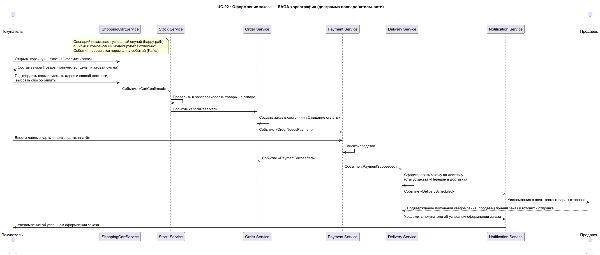
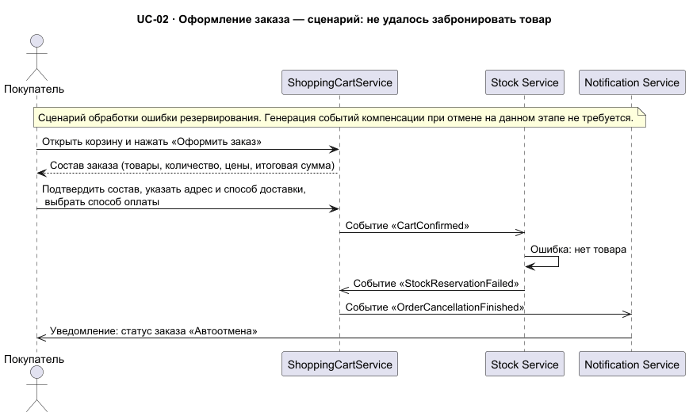
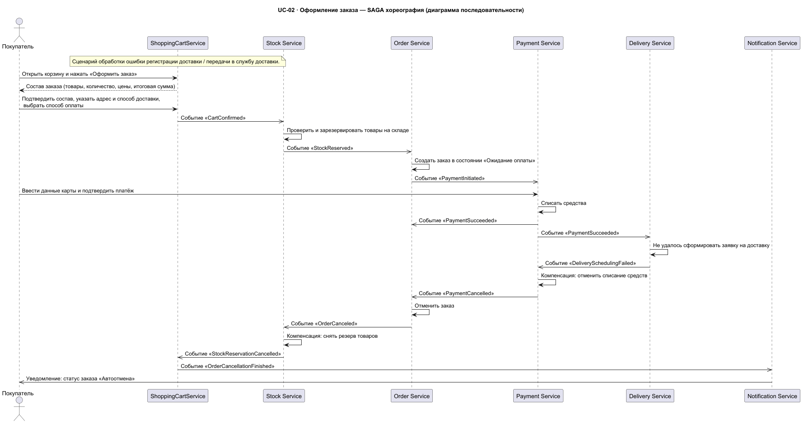
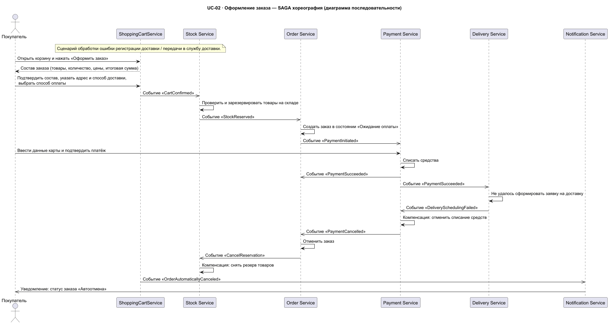
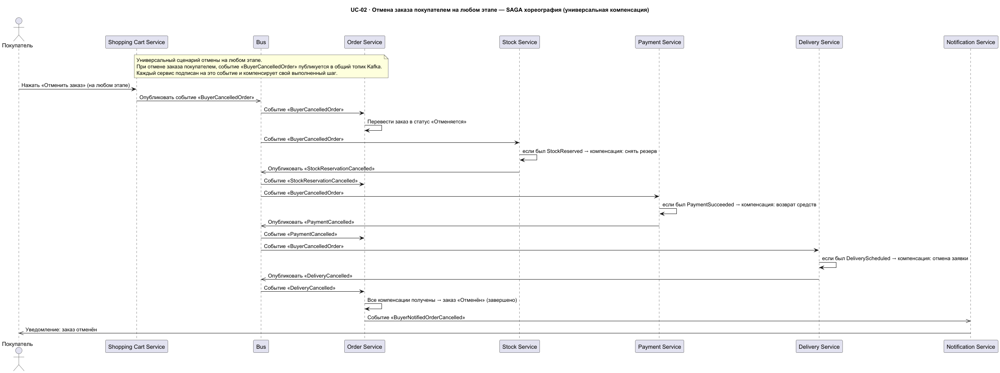

**Данный файл сгенерирован с помощью ИИ для описания артефактов проделанной работы**

### Название задачи: Оформление заказа (UC-02) — SAGA-хореография: сценарии и компенсации

**Автор:** Иван Бабиков
**Дата:** 16.09.2026

**Связанные документы:** [ADR-02 — Выбор паттерна SAGA](ADR-02-SAGA-pattern-choice.md), [Реестр событий SAGA](saga-events-registry.md), [Обзор архитектуры (C2)](C2-architecture-overview.md)

---

### Назначение документа

Данный документ **суммирует и связывает** поведенческие диаграммы последовательности, добавленные после выбора паттерна в [ADR-02](ADR-02-SAGA-pattern-choice.md) (хореография на Kafka). Это дизайн-документ (design/blueprint), **не** ADR: он не принимает новых решений, а детализирует сценарии выполнения и компенсации для уже выбранного паттерна.

Рассматриваются:

- счастливый путь (happy path);
- сценарии отказа и компенсаций:
  - ошибка резервирования товара;
  - ошибка оплаты;
  - ошибка регистрации доставки;
  - отмена заказа покупателем на любом этапе.

Совместно с [реестром событий](saga-events-registry.md) этот документ задаёт контракты и порядка компенсационных шагов для каждого сценария, покрывая риск из ADR-02: *«моделирование ошибок и компенсаций выполняется отдельно от happy-path»*.

---

### 1. Счастливый путь (happy path)

Исходник: [seq-order-placement-choreography-happy-path.puml](seq-order-placement-choreography-happy-path.puml)

**Краткая последовательность:**

1. Покупатель подтверждает состав → `CartConfirmed` (Shopping Cart Service).
2. Stock Service резервирует товары → `StockReserved`.
3. Order Service создаёт заказ («Ожидание оплаты») → `OrderNeedsPayment`.
4. Покупатель оплачивает → `PaymentSucceeded`.
5. Delivery Service формирует заявку → `DeliveryScheduled`, уведомление продавцу и покупателю.

---

### 2. Сценарии отказа и компенсации (сводная матрица)

Сводка всех нештатных сценариев. Порядок и издатели компенсирующих событий соответствуют событиям из [реестра](saga-events-registry.md).

| № | Сценарий | Триггер | Компенсационный поток | Итог |
|:--|:--|:--|:--|:--|
| 1 | Ошибка резервирования товара | `StockReservationFailed` | Нет компенсаций (резерв не выполнялся) → `UnableToCreateOrder` | Заказ не создан |
| 2 | Ошибка оплаты | `PaymentFailed` | Order Service → `OrderCancelled` → Stock Service → `StockReservationCancelled` → `OrderCancellationFinished` | Автоотмена |
| 3 | Ошибка регистрации доставки | `DeliverySchedulingFailed` | Payment Service → `PaymentCancelled` → Order Service → `OrderCancelled` → Stock Service → `StockReservationCancelled` → `OrderCancellationFinished` | Автоотмена |
| 4 | Отмена покупателем на любом этапе | `BuyerCancelledOrder` | Stock Service → `StockReservationCancelled`, Payment Service → `PaymentCancelled`, Delivery Service → `DeliveryCancelled`, Order Service → `OrderCancellationFinished` | Отменён |

---

#### 2.1. Ошибка резервирования товара

Исходник: [seq-order-placement-choreography-stock-reservation-failed.puml](seq-order-placement-choreography-stock-reservation-failed.puml)

Резерв не выполнен → генерация компенсаций не требуется. `StockReservationFailed` → `UnableToCreateOrder` → уведомление покупателю «Автоотмена».

---

#### 2.2. Ошибка оплаты

Исходник: [seq-order-placement-choreography-payment-failed.puml](seq-order-placement-choreography-payment-failed.puml)

`PaymentFailed` → Order Service отменяет заказ (`OrderCancelled`) → Stock Service снимает резерв (`StockReservationCancelled`) → `OrderCancellationFinished` → уведомление «Автоотмена».

---

#### 2.3. Ошибка регистрации доставки

Исходник: [seq-order-placement-choreography-delivery-scheduling-failed.puml](seq-order-placement-choreography-delivery-scheduling-failed.puml)

`DeliverySchedulingFailed` → Payment Service компенсирует списание (`PaymentCancelled`) → Order Service (`OrderCancelled`) → Stock Service снимает резерв (`StockReservationCancelled`) → `OrderCancellationFinished` → уведомление «Автоотмена».

---

#### 2.4. Отмена заказа покупателем на любом этапе

Исходник: [seq-order-placement-choreography-buyer-cancel.puml](seq-order-placement-choreography-buyer-cancel.puml)

Универсальный сценарий: событие `BuyerCancelledOrder` публикуется в общий топик Kafka; каждый сервис, подписанный на него, компенсирует **свой выполненный шаг** (резерв/списание/заявку) и публикует соответствующее компенсирующее событие (`StockReservationCancelled`, `PaymentCancelled`, `DeliveryCancelled`), затем Order Service фиксирует завершённую отмену (`OrderCancellationFinished`).

---

### 3. Практические следствия для реализации (риски ADR-02)

Соблюдая решение ADR-02, при реализации необходимо учитывать:

- **at-least-once и идемпотентность** — один и тот же компенсирующий шаг может обрабатываться повторно из-за дублей событий;
- **eventual consistency** — статус заказа меняется асинхронно, это закладывается в продуктовые сценарии UI;
- **согласованность реестра событий** — любые правки в диаграммах должны отражаться в [saga-events-registry.md](saga-events-registry.md).

---

### Статус

**Принят** (документация сценариев и компенсаций для решения ADR-02, не является новым решением).