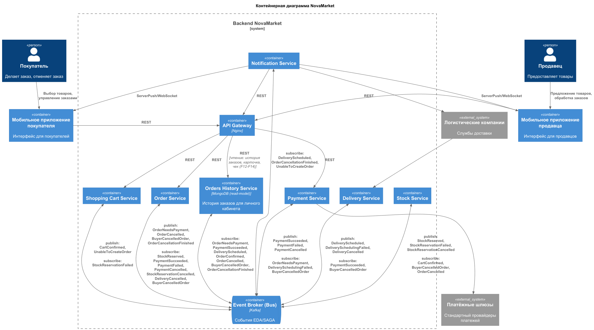

### **Название задачи:** Предложение по серверной архитектуре функции просмотра заказов в личном кабинете 
### **Автор:** Иван Бабиков
### **Дата:** 16.09.2026
### **Функциональные требования**

|**№**|**Действующие лица или системы**|**Use Case**|**Описание**|
| :-: | :- | :- | :- |
| F12 | Покупатель |[Просмотр заказов](../NovaMarket/UseCases/6-orders-history.md)| Просмотр истории заказов покупателем|
| F13 | Покупатель |[Просмотр карточки заказа](../NovaMarket/UseCases/6-orders-history.md)| Просмотр карточки заказа покупателем|
| F14 | Покупатель |[Получение чека заказа](../NovaMarket/UseCases/6-orders-history.md)| Скачивание чека покупателем|
| F15 | Покупатель |[Просмотр купленного товара](../NovaMarket/UseCases/6-orders-history.md)| Покупатель переходит в карточку купленного товара|

### **Нефункциональные требования**

|**№**|**Требование**|
| :-: | :- |
| U4 | При изменении статуса заказа, задержка актуализации его отображения не должна превышать 5 секунд |
| U5 | Отклик должен быть минимальным и не превышать одной секунды в 99,99%. При этом ожидаемый показатель в 98% равен 0,3 секунды |

### **Результаты предварительного анализа**

Для показа детализированной информации о заказе, требуются данные из нескольких сервисов: Order Service (основные данные о заказе), Payment Service (детализация оплаты), Delivery Service (детальные данные о доставке) и в перспективе Stock Service (если понадобятся дополнительные данные о товарах).

Очевидно, что получение данных из нескольких источников может создать следующие трудности:

1. Непреемлемая задержка, когда скорость выполнения всего запроса будет зависеть от скорости выполнения запроса к самому медленному из сервисов.
2. Указанные выше сервисы и их БД уже нагруженны обслуживанием новых заказов. Лишняя нагрузка им не к чему. 

Исходя из технического уровня команды, для реализации нужно будет применить один из паттернов или их комбинацию: API Composition, CQRS, Event Sourcing.

### **Решение**

Выбираем **CQRS с перехватом имеющихся событий процесса заказа из Kafka**.

*Рис. 1 — Контейнерная диаграмма (C2) решения: Orders History Service как CQRS. Исходник: [C2.puml](C2.puml).*

**Логика выбора.** Обе проблемы из предварительного анализа (задержка от самого медленного сервиса и лишняя нагрузка на Order/Payment/Delivery) возникают из-за того, что данные распределены, а для быстрое чтение можно обеспечить с помощью предварительного агрегирования. Паттерн с синхронной сборкой по запросу (API Composition) явно нарушает требование U5 по скорости отклика и умножает нагрузку на сервисы.

**Как устроено:**
1. Добавляем **Orders History Service** - read-only сервис с собственной денормализованной БД - витриной данных заказов (заказ + товары + статус + оплата + доставка), с индексами по `customerId` и дате.
2. Источником данных будут **уже существующие доменные события SAGA** ([saga-events-registry.md](../Task1/saga-events-registry.md)): `OrderNeedsPayment`, `PaymentSucceeded`, `DeliveryScheduled`, `OrderConfirmed`, `OrderCancelled`, `BuyerCancelledOrder` и т.д, которые будут вычерпываться сервисом истории заказов из уже существующих Топиков Кафка. 
3. **Процесс обработки заказов не меняется**: Order/Payment/Delivery не обслуживают read-запросы (закрывает проблему №2 и требование U2). Чтение данных идёт из локальной витрины одним обращением к БД, опроса нескольких источников.
4. **Актуализация статуса** - через поток событий, ожидаетя задержка значительно меньше, чем 5 с (выполняется требование U4).
5. **Event Sourcing не внедряем**: события для витрины уже публикуются в SAGA.

**Выбор БД для Orders History Service - MongoDB.** Read-only данные хранятся в виде документов на заказы со структурой: заказ + товары + оплата + доставка. Чтение выполняется локальным индексированным запросом по `customerId + createdAt` с пагинацией. Схема документа может ограниченно эволюционировать по мере добавления новых полей (например, данных из Stock) без миграций схемы. Исходные данные в других сервисах, поэтому требования ACID и сложных транзакций к витрине не предъявляются.

### **Альтернативы**

**Альтернатива 1 - API Composition (агрегатор).** Синхронные вызовы Order/Payment/Delivery/Stock при запросе. Проще в эксплуатации и всегда свежие данные, но время отклика равено как минимум времени отклика самого медленного сервиса - есть риск нарушить требование U5, а при 40 000+ заказах/день (требование U2) кратно растёт нагрузка на сервисы. Также отказ или перезагрузка одного сервиса ломает всё чтение. Годится на малых объёмах или как временный этап.

**Альтернатива 2 - Полный Event Sourcing.** Хранить заказы как поток событий и строить read-модель из данных потока и снэпшотов. Даёт аудит и реконструкцию состояния на любой момент времени, но для задачи избыточен: требует перестройки процесса обработки заказа, тогда как события для витрины уже есть в SAGA. Предлагается отложить до случая появления требований аудита.

**Альтернатива 3 - PostgreSQL для витрины Orders History Service.** Оправдана, если команда хочет единый SQL-стек: при 40 000 заказах в день реляционная БД справится. Но для витрины с вложенными товарами/оплатой/доставкой потребуются либо JSONB-поля (документ с менее удобными индексами на вложенные массивы), либо схема-«звезда» с JOIN-ами на чтение - что частично возвращает проблему медленной сборки из предварительного анализа.

**Недостатки, ограничения, риски**

- **Eventual consistency**: возможна кратковременная несогласованность (в пределах требования U4 (задержка меньше 5 с)).
- **Дублирование схем**: витрина копирует данные других сервисов; изменение формата данных в исходных сервисах  потребует версионирования событий и возможно обновления в сервисе истории заказов.
- **Сбои обработки событий**: сбой одного события не должен блокировать остальные - нужны Dead Letter Queue, ретраи и мониторинг лага потребителя.
- **Дополнительная инфраструктура**: новый сервис, это новая БД + консьюмеры => рост расходов на эксплуатаци. и нагрузочное тестирование.

